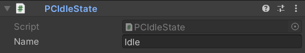

.. _creating-states-for-an-actor-page:

Creating States for an Actor
============================

What is a state?
----------------

A state represents a specific group of actions that should be performed while an actor's specific condition is met.

The usage strategy
------------------

After being correctly crafted, a :ref:`State <state-class>` script should be attached to the same GameObject as the 
:ref:`StateMachine <state-machine-class>`. The machine will then automatically recognize it and use it as it should.

Also, the :ref:`State <state-class>` class, as the :ref:`Actor <actor-class>` class, is abstract. It is so because a state is specific for an specific actor.
Being that way, it does not make any sense to a state to exist without knowing its reason for being.

.. raw:: html
   
   <video width="800" height="450" loop autoplay muted controls>
      <source src="../../_static/videos/attaching-states.mp4" type="video/mp4">
   </video>  

|

The code
--------

Below is the base code for a successful state. Take a look at it and feel free to copy and use it as you wish.

.. code-block:: csharp

   using System;
   using System.Collections;
   using System.Collections.Generic;
   using UnityEngine;
   using IndieGabo.FSM;

   public class MySpecialState : State
   {
   
      #region State Methods

      public void OnLoad()
      {
         // Register your transitions here
      }

      public void OnEnter()
      {
         // Executed at the same frame actor enters this state
      }

      public void OnExit()
      {
         // Executed at the same frame actor exits this state
      }

      public void Tick()
      {
         // Actor's Update() 
      }

      public void LateTick()
      {
         // Actor's LateUpdate()
      }

      public void FixedTick()
      {
         // Actor's FixedUpdate()
      }

      #endregion
   }

And, of course, there is a Script Template ready for you at *Create* ``->`` *IndieGabo* ``->`` *FSM* ``->`` *New State*.

.. raw:: html
   
   <video width="800" height="450" loop autoplay muted controls>
      <source src="../../_static/videos/new-state-from-template.mp4" type="video/mp4">
   </video>  

|

Ok. Now that we've seen the code, let's take a deep dive into each of those methods. All these methods are optional and you only need to implement the ones
you will use inside your state.

OnLoad()
--------

This method represents the moment a :ref:`StateMachine <state-machine-class>` loads this :ref:`State <state-class>` script into its handled states. So it is inside
the ``State.OnLoad()`` that you should put any logic regardind initialization **before** the machine starts running.

.. code-block:: csharp

      // Some other code

      Func<bool> Falling => () => actor.rigidBody2D.velocity.y < 0;

      public void OnLoad()
      {
         // Register transitions and stuff
         AddTransition(Falling, GetComponent<FallingState>());
      }

      // Some other code

The ``State.OnLoad()`` is the best place to register transitions. Wich we will cover on the 
:ref:`Transitioning Between States <transitioning-between-states>` section.

This method is called only once in the :ref:`StateMachine <state-machine-class>` life cycle.
   
OnEnter()
---------

This method is called the **exact moment** a :ref:`StateMachine <state-machine-class>` sets this :ref:`State <state-class>` script as its current state.

.. code-block:: csharp

      // Some other code

      public void OnEnter()
      {
         actor.animator.SetBool("isWalking", true);
      }

      // Some other code

The ``State.OnEnter()`` is perfect for start playing animations, initializing variables, properties and etc.

OnExit()
--------

This method is called **right before** a :ref:`StateMachine <state-machine-class>` wich has this :ref:`State <state-class>` script as its current state, transition into another
state.

.. code-block:: csharp

      // Some other code

      public void OnExit()
      {
         actor.animator.SetBool("isWalking", false);
      }

      // Some other code

The ``State.OnExit()`` is perfect place to stop animations and reset variables, properties and etc.

Tickers
-------

Once a State is defined as current state by the machine, its "Ticker methods" will be called at each 
time its actor "frame handlers" are executed.

They are:

1. ``Tick()``: Called every time the actor `Update() <https://docs.unity3d.com/ScriptReference/MonoBehaviour.Update.html>`_ method is called.
2. ``LateTick()``: Called every time the actor `LateUpdate() <https://docs.unity3d.com/ScriptReference/MonoBehaviour.LateUpdate.html>`_ method is called.
3. ``FixedTick()``: Called every time the actor `FixedUpdate() <https://docs.unity3d.com/ScriptReference/MonoBehaviour.FixedUpdate.html>`_ method is called.

.. code-block:: csharp

      // Some other code

      float xSpeed = 10.0f;
      float xInput;

      public void Tick()
      {
         xInput = Input.GetAxis("Horizontal");
      }

      public void FixedTick()
      {
         actor.rigidBody2D.velocity = new Vector2(xInput * xSpeed, actor.rigidBody2D.velocity.y);
      }

      public void LateTick()
      {
         if (xInput != 0) {
            actor.camera.ZoomIn();
         }
         else {
            actor.camera.ZoomOut();
         }
      }

      // Some other code

.. hint:: 
   
   If you are not familiar with the `LateUpdate() <https://docs.unity3d.com/ScriptReference/MonoBehaviour.LateUpdate.html>`_ method, it is called once per frame after the 
   `Update() <https://docs.unity3d.com/ScriptReference/MonoBehaviour.Update.html>`_ as a way to organize your script execution.

Refer to the :ref:`IndieGabo's FSM Life Cycle <lifecycle>` for visual information about Tickers being called.

.. _transitioning-between-states:

Transitioning Between States
----------------------------

There are two ways for a state to transition into another state:

1. By calling the Machine's ``ChangeState()`` method.

.. note::
   
   As seen on the :ref:`State Documentation <state-class>`, all the states hold reference to the Machine they belong to. Therefore, accessing 
   the machine's methods from within a state is as easy as using its ``State.machine`` property as we can see below.

.. code-block:: csharp
    
    // Some other code

    public void FixedTick()
    {
      
         if (somethingWeirdHappened)
         {
            State newState = GetComponent<OtherState>();
            machine.ChangeState(newState);
         }

    }  

    // Some other code

2. By registering a :ref:`StateTransition <state-transition-class>` inside its ``State.OnLoad()`` using the ``State.AddTransition()`` method.

Using this approach (wich is highly recommended) the machine will, at each of the "frame handlers", evaluate if any condition is met 
considering given priorities. If so, it will automatically transition into the target state.

A :ref:`StateTransition <state-transition-class>` consists in a ``Condition``, a target ``State`` and a ``priotity`` level. But there is no need for 
you to instantiate it. Just call the ``State.AddTransition()`` method and pass the those 3 arguments. I take care of the rest for you. Here is how
you use it:

.. code-block:: csharp

   Func<bool> Condition => () => something > anotherThing;
   State someState = GetComponent<SomeState>();
   int priority = 1;
   
   AddTransition(Condition, someState, priority);

But, if you somehow prefer, here is how a StateTransition is instantiated and registered:

.. code-block:: csharp

   Func<bool> Condition => () => something > anotherThing;
   State someState = GetComponent<SomeState>();
   int priority = 1;
   
   StateTransition transition = new StateTransition(Condition, someState, priority);
   AddTransition(transition);

Note that to declare a ``Condition`` you **MUST** approach using a 
`Func<TResult> Delegate <https://docs.microsoft.com/en-us/dotnet/api/system.func-1?view=net-6.0>`_. Do not worry if you are not 
familiar with this yet. All you need to know is that the machine will call this as a method (function) and its context will be 
evaluated as true or false only when the machine do so. In case this represents news for you, for now, 
just follow the syntax in the code below each time you want to register a :ref:`StateTransition <state-transition-class>` in a state.

To declare the target state, since all states are components attached to the same GameObject, you can just use the ``GetComponent<State>()`` method.

At last, priority for the machine is read **descending**. Wich means the higher the integer you give as third argument, sooner its condition will be evaluated.
otherwise it will be read as the declaration order. The default priority value is ``0``.

.. code-block:: csharp
    
    // Some other code

    // Example of conditions using delegate functions and recurring to lambda functions
    // IMPORTANT!! It MUST be a delegate function. Check the docs for further understanding
    protected Func<bool> Idle => () => actor.rigidBody2D.velociy.x == 0; // Here we take advantage on lambda functions so we do not need to declare a method.
    protected Func<bool> Moving => () => actor.rigidBody2D.velociy.x != 0;

    // Called to set the state able to be used by the Machine.
    // Usually where you should register state transitions.
    public void OnLoad()
    {
        // Example of how to add transitions 
        AddTransition(Idle, GetComponent<MovingState>()); // No priority means priority = 0
        AddTransition(Moving, GetComponent<MovingState>(), 1); // Setting higher priority on third argument for this one. It will be executed before.
    } 

    // Some other code

.. note::
   The ``State.OnLoad()`` is called only once on the Machine's life cycle. Meaning that any ``GetComponent<State>()``
   (or, well... anything else) used inside of it will not be called multiple times.

The inspector
-------------

For a simple state, a simple name. Just that. You can set a Name for your state using Unity's inspector so you get some better visual feedback 
when taking a look at the state machine.

Set a name:

And see it in action while inpecting the StateMachine:

.. image:: ../../_static/images/state-machine-inspector-runtime.png
   :alt: State Name appearing on machine

That is it about creating a state for now. Let me show you a little about :ref:`how to use <using-the-state-machine-class>` 
our precious state machine.

.. raw:: html

     

|
